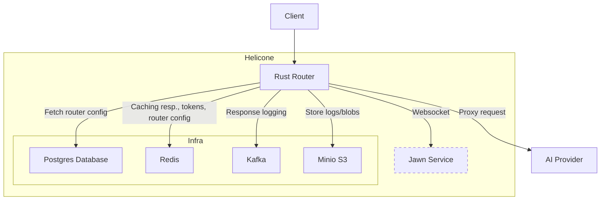
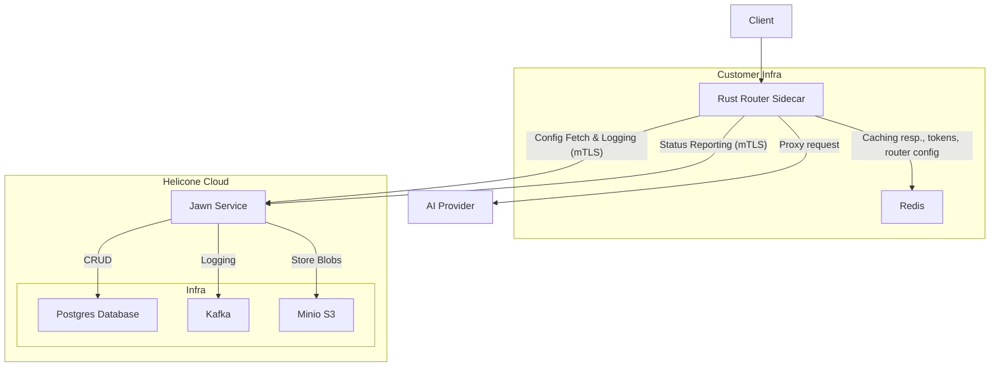
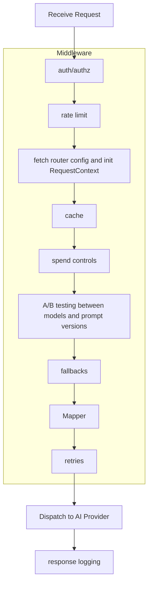

# Rust Worker

[MVP requirements](https://www.notion.so/MVP-requirements-1d8c78c0f25e80278323c3446d56945a?pvs=21)

# Summary

A configurable proxy router for LLM APIs that enables seamless request routing, caching, A/B testing, load balancing, fallbacks, retries, rate limiting, and spend controls. The goal is to offer a fast, reliable, and flexible foundation for developers building on top of multiple AI providers. Written in Rust and built upon well-established middleware patterns (via Tower), it's blazingly fast and insanely composable.

Project plan: [Rust Proxy Project Plan](https://www.notion.so/Rust-Proxy-Project-Plan-1d5c78c0f25e80df9671f909f1966e8b?pvs=21)

TODO: replace with Linear

# Motivation

## Goals

- **Differentiation:** Establish a unique selling point and signal to both clients and potential team members that the platform is built for reliability and ease-of-extension.
- **Reliability and Composability:** Leverage Rust’s safety guarantees and Tower’s middleware ecosystem to build a system that is easy to refactor and maintain, even as complexity grows.
- **Modularity:** Enable developers to enable/disable features (e.g., caching, rate limiting, retries) through modular middleware components, thereby reducing duplicated logic and centralizing common behaviors.
- **Developer Experience:** Provide a robust and well-documented proxy service that reduces integration friction when dealing with multiple AI providers. This should be a single binary that can easily be used for Helicone’s cloud hosted or a self-hosted sidecar.

## Non-Goals

- Huge performance gains: while we hope to increase the performance (both throughput and latency) of the proxy, given the high amount of async I/O involved with LLM API usage due to the high latency of the AI providers, it's unlikely that Rust will actually be able to provide a significant performance boost over the TypeScript CF worker implementation.

# Guide-level explanation

## Example Usage and Features

First, the user will need to login to the Helicone dashboard at [https://helicone.ai](https://helicone.ai/) and create a router, a Helicone API key, and upload their API keys from their target providers.

Then the user will configure the router features which include:

1. The default provider of the model (only required option)
2. Cache
    1. SIA wants to cache in S3 but would prefer using Redis
3. Model fallback (note: lower priority)
4. A/B testing by provider, model, and/or prompt (note: lower priority)
5. Load balancing by Model → Provider → Region/deployments
6. Retries
7. Rate limiting per user, team, provider, model, region/deployment
8. Spend controls

This should be configurable in a nice UI. Quick and dirty mockups are available in the Appendix. This router configuration is then stored in a Posgres table. For details on the configuration, an example YAML configuration can be seen in the reference section [here](https://www.notion.so/Rust-Worker-1c5c78c0f25e800d862bd77bb4b576ef?pvs=21).

Once the router is created, the customer can then send requests by replacing the `base_url` and `api_key` when instantiating their OpenAI SDK:

```python
from openai import OpenAI

client = OpenAI(
  base_url="<https://worker.helicone.ai/router/><HELICONE_ROUTER_ID_SLUG>",
  api_key="<HELICONE_API_KEY>",
)

completion = client.chat.completions.create(
  extra_headers={
    "Helicone-Property-Conversation-Source": "support",
    "Helicone-Property-App": "mobile",
  },
  model="openai/gpt-4o",
  messages=[
    {
      "role": "user",
      "content": "What is the meaning of life?"
    }
  ]
)

print(completion.choices[0].message.content)

```

Alternatively, users can omit the specific router ID slug to use a default router configuration:

```python
# Use the default router
client = OpenAI(
  base_url="<https://worker.helicone.ai/router>",
  api_key="<HELICONE_API_KEY>",
)

```

This default router is defined in the router's configuration source. In sidecar or self-hosted mode, users can customize this default configuration. In the cloud-hosted mode (`https://router.helicone.ai`), the default router is pre-configured by Helicone to provide basic routing across multiple providers.

These requests will then be sent to our cloud-hosted service which will proxy it to the right provider according to the `RouterConfig`.

## Envisioned UI

The UI could have the following screens:

- Router dashboard
- Router details
- Router configuration
- Sidecar dashboard
- Sidecar details

Screenshots of mock ups for these screens are available in the Appendix.

## Deployment Target

The Helicone router can be easily deployed to the following targets:

1. **Cloud mode** – Helicone runs the binary on [Fly.io](http://fly.io/), pointing it at Helicone‑managed Redis/Postgres/Vault, available at [`https://router.helicone.ai`](https://router.helicone.ai/) .
2. **Sidecar mode** – Customers run the Helicone router binary (Docker or Helm). They supply:
    - A Redis cluster they control (often co‑located for latency) for caching the `RouterConfig` and the API requests/responses if caching is enabled.
    - Optional: AWS Secrets Manager configuration
        - Via using a `Box<dyn SomeVaultTrait>` we can make swapping out the cloud hosted vault management possible for a remote one like AWS secrets manager. We could also add support for additional options in the future, like HashiCorp Vault.
    - Their Helicone API key for control‑plane authentication (e.g. for reporting the sidecar status in the Helicone dashboard).
    - The sidecar will utilize Helicone’s cloud hosted Postgres for fetching the initial `RouterConfig` upon the first request and Kafka and S3 for response logging.
    - The sidecar will communicate with the central Helicone Jawn service via mutual TLS (mTLS) to securely fetch `RouterConfig` and log request/response data. It will only require direct access to the customer-controlled Redis instance.
3. **Self hosted mode** - Customer runs the Helicone stack + the sidecar binary.

## Architecture Diagram

The following diagram visualizes the architecture for the different deployment targets:

Cloud hosted solution and self hosted are identical in diagram form.



Sidecar mode:



## Rust Service

First, it's very useful to get familiar with the [`tower`](https://docs.rs/tower/latest/tower/) crate as it is the foundation of our service. The following excerpt from their docs helps contextualize `tower`'s usefulness:

> Tower provides a simple core abstraction, the Service trait, which represents an asynchronous function taking a request and returning either a response or an error.
> 
> 
> Generic components, like [`timeout`](https://docs.rs/tower/latest/tower/timeout/index.html), [rate limiting](https://docs.rs/tower/latest/tower/limit/rate/index.html), and [load balancing](https://docs.rs/tower/latest/tower/balance/index.html), can be modeled as [`Service`](https://docs.rs/tower/latest/tower/trait.Service.html)s that wrap some inner service and apply additional behavior before or after the inner service is called. This allows implementing these components in a protocol-agnostic, composable way. Typically, such services are referred to as *middleware*.
> 

Imagine the Rust Router as "Service Stack" that layers tower middleware over a leaf service, so each request runs through each of the middleware layers before being proxied to the LLM API Providers.

Each middleware can implement the logic for the individual features we wish, making the implementation extremely modular, composable, and unit-test-able.

## Request Flow

The following diagram visualizes the request flow and the middleware stack:



## Key Tower Concepts

- **Extensions:** Used to store all relevant metadata (e.g., rate limiting info, routing configurations, and other configurations) required for request processing in a `RequestContext` struct.
- **Leaf Service:** The innermost `tower::Service` in a service stack, in our case, the `Dispatcher` that proxies the request to the AI provider.
- **Mapping with TryConvert Trait:** A trait based off [`std::convert::TryFrom`](https://doc.rust-lang.org/stable/std/convert/trait.TryFrom.html) used to map API request types for any types that implement `TryConvert<SourceType, DestType>`. The custom trait allows us to implement the trait even for types we don't own.
- **Middleware Layers:** Individual components—such as caching, authentication/authorization, rate limiting, and payload logging—that wrap around the core router logic, each implemented as Tower services/layers.

# Reference-level explanation

## Router Configuration

### Source

The router configuration will be fetch-able from the following sources:

- YAML config
- Postgres

This will be implemented via a trait object so we can make the source configurable.

### Versioning

- Each `RouterConfig` carries a **`version` .** A ****UUID for the version is likely sufficient since SemVer wouldn’t be very meaningful in this case.
- Configs are **immutable** once stored; “editing” creates a new version.
- Incoming requests carry a snapshot of the active config in `Extensions`; in‑flight requests therefore finish under the exact settings they started with, even if a new config version is published mid‑flight.

### Example

The following YAML shows an example configuration of the Rust router:

```yaml
cache:
  enabled: true
  max-bucket-size: 10
  seed: "router-seed-1"
  # cache-control header
  directive:
    max-age: 3600
    max-stale: 1800

default-provider: "openai"

fallback:
  enabled: true
  order:
    - provider: "anthropic"
    - provider: "bedrock"

# validated that weights add up to 1.0
# on creation and update
balance:
  strategy: weighted
  providers:
		anthropic:
			weight: '0.3'
		openai:
			weight: '0.7'
      regions: ["us-east-1", "us-west-1"]

# Alternatively
#balance:
#  strategy: p2c
#  providers:
#		- name: anthropic
#		- name: bedrock
#     regions: ["us-east-1", "us-west-1"]

retries:
  enabled: true
  max_retries: 2
  strategy: "exponential-backoff"
  base: "100ms"
  max: "10s"

spend-controls:
   foo-org:
     units: "USD"
     quota: 1000
     replenish-interval: "1 week"
   bar-org:
     units: "USD"
     quota: 500
     replenish-interval: "1 week"

rate-limits:
  # other options: requests/tokens
  per-user:
    units: cost
    currency: USD
    quota: 100
    refresh-interval: "1 day"
  per-org:
    units: cost
    currency: USD
    quota: 1000
    refresh-interval: "1 day"
  per-provider:
    units: tokens
    quota: 1000000
    refresh-interval: "1 day"
  per-provider-region:
    units: requests
    quota: 20000
    refresh-interval: "1 week"
  per-model:
    units: requests
    quota: 1000
    refresh-interval: "1 day"
```

### Router Dispatching

To support both a default router configuration (accessed via `/router`) and specific, named router configurations (accessed via `/router/<slug>`), a preliminary routing layer is required. This "router of routers" acts as the initial entry point for incoming requests.

Its primary responsibility is to inspect the request path and determine which `RouterConfig` should be loaded and used for the request:

- If the path matches the base router path (e.g., `/router`), it loads the pre-defined default `RouterConfig`.
- If the path includes a slug (e.g., `/router/my-specific-config`), it attempts to fetch the `RouterConfig` associated with that specific slug from the configured source (e.g., Postgres or YAML file).

Once the appropriate `RouterConfig` is identified (or determined not to exist), this dispatching layer passes the request and the selected config (likely stored in `RequestContext`) down to the main middleware stack for processing according to that specific router's rules (caching, fallbacks, etc.). This layer essentially selects the correct set of rules before the request processing begins.

### Caching

The router configurations would be fetched from the configured source on the first request and then would be cached in Redis. The sidecar will maintain a consistent WebSocket connection with Jawn.

The sidecar would tell Jawn which `RouterConfig`s it knows in its cache (and their versions), and then Jawn would send events whenever a `RouterConfig` is updated so the sidecar can fetch the latest and update its cache. There will also be a button to “force-push” an update, in case e.g. there wasn’t an active connection with the sidecar when the router was updated.

This would be implemented as a background tokio task which opens a persistent WS to **Jawn**. A heartbeat is exchanged every 30 s; if two heartbeats are missed, the sidecar:

1. polls a REST `/router/:id/updated_at` endpoint every 10 s, and
2. attempts WS reconnect with exponential back‑off.

### DB/Cache Failure Behavior

In a shit-hit-the-fan scenario, where Postgres and Redis are down, the sidecar wouldn’t be able to fetch any `RouterConfig`s at all. This means we won’t be able to proxy requests for a given Router id.

The proposed solution consists of a few simple steps we can take now to reduce the risk of SHTF, but not eliminate it, and a proposed future possibility to make this more bulletproof. What we can do is the following:

| Step | Where to fetch config | Why it works |
| --- | --- | --- |
| In memory LRU | Last N configs held in memory | For sidecar, number of configs likely low. For cloud hosted, a high N value will probably use a lot of memory. |
| Local snapshot file | eg /var/cache/helicone/router‑42.bootstrap | Survives container restarts and unavailability of DB/Redis |

This is still problematic if we never created a snapshot file but it does greatly reduce the risk of a customer’s sidecar not working due to an infrastructure issue on Helicone’s end.

## App configuration

For an example of the configuration required for the application itself to get a sense of deployment ease, this shows the kinds of things required to be configured. Many of these will be available via sensible defaults so the real configuration will be light. To improve this section once further along in POC

```yaml
rate-limit:
  unauthenticated:
    replenish-interval: 10
    quota: 25
  authenticated:
    replenish-interval: 2
    quota: 50

# log levels, opentelemetry exporter
telemetry: ...
# listen port for prometheus metrics server
metrics-server: ...
# listen port, shutdowns, timeout
server: ...
  deployment-target: "sidecar"
database: ...
minio: ...
is-production: false
```

## Load Balancing

We will support the following load balancing strategies:

- Latency optimized [p2c](https://www.eecs.harvard.edu/~michaelm/postscripts/handbook2001.pdf). Load can be determined via either:
    - A moving average of the peak latency for the service.
    - Count of in-flight requests
- Weighted strategy: This would allow targeting certain spend per provider. For example, if there are 3 services: [A, B, C] with weights [0.99, 0.005, 0.005] then a user would likely expect that (assuming everything else is equal):
    - Service A would serve 99%
    - Service B would serve 0.5%
    - Service C would serve 0.5%

The hierarchy should be model → provider → region/deployment.
Within a provider, we will always load balance via the latency
strategy.

If a provider starts failing health checks, we should dynamically remove them from the pool of available providers.

## Request Mapping

Since every router configuration will have a default target, we will always know the “original” intended target for a request: the default. However, the target can change depending on load balancing, retries, fallbacks, etc. We should write a tower middleware that can use the `RequestContext` to determine if the request target was changed and if so, to what, so that we can then use the `TryConvert` trait to map the request bodies before sending the request.

## Response Caching

Response caching should be put behind a trait so we can swap out the backend where they are stored. We should support S3 and Redis to start.

## Metrics & Observability

The router service should expose the following: prometheus metrics

| Layer | Metric examples |
| --- | --- |
| Auth | unauthorized reqs/min |
| Rate‑limit | tokens left, 429/s |
| Cache | hit/miss ratio, lookup p95 |
| A/B | traffic % vs expected |
| Fallback | invocations / provider |
| End‑to‑end | p50/95/99 latency, error rate |
| System | CPU, memory, net IO, WS heartbeat latency |

We expose Prometheus endpoints and ship ready‑made **Grafana dashboard JSON** that customers can import with one click.

## Tower Services

Srsly go read the  [`tower::Service`](https://docs.rs/tower/latest/tower/trait.Service.html)  page rn.

## Request flow

1. **Authentication & Authorization:**
    1. Leverage [tower-http::auth](https://docs.rs/tower-http)
    2. For RBAC, there is heavy inspiration we can take from [`axum-login`](https://docs.rs/axum-login/latest/axum_login/).
    3. By default we should just proxy without checking any auth before proxying.
        - TOM: I need to think about how to do this safely… this would mean the router ID is essentially a secret, right, since knowing someone’s router ID would then mean you would be able to use their API keys. Could we like encrypt the token with a secret only jawn knows that the sidecar fetches on startup so even if auth check fails, we validate the token is a valid one? this means the attack surface is other helicone customers that know the router ID + traceability back to the attacker?.
2. **Rate limit middleware**
    1. Leveraging [`tower-governor`](https://docs.rs/tower_governor/latest/tower_governor/)
    2. Configured in the UI for the router, but compatible with current Helicone feature: [docs](https://docs.helicone.ai/features/advanced-usage/custom-rate-limits). E.g. `"Helicone-RateLimit-Policy": "[quota];w=[time_window]u=[unit];s=[segment]"`
        1. Note we won’t manage `u=[unit];s=[segment]` in this middleware in order to leverage `tower-governor`, instead we can manage any spend related limiting in the Spend Control layer.
    3. Use Redis
3. **RequestContext Initialization**:
    1. A Tower middleware extracts any custom headers (e.g. custom properties) from the request and fetches the `RouterConfig` from the database in order to build the `RequestContext` struct.
    2. This context includes information like:
        1. `RouterConfig` (things like cache, fallback, retry config, etc),
        2. `HeliconeContext` (custom Helicone specific metadata like custom properties, prompt inputs, etc)
        3. Request metadata like the start time of the request, client's country code, etc.
    3. This is then stored in the request extensions and usable for subsequent middleware layers.
4. **Caching**
    1. A custom tower middleware that leverages the `RouterConfig` in the `RequestContext` to cache responses accordingly in a KV store.
    2. Use Redis
    3. Partial caching support would be ideal, but so far this is out of scope.
5. **Spend controls**
    1. A custom tower middleware that reads from a materialized sum of the spend and responds with [`retry-after`](https://developer.mozilla.org/en-US/docs/Web/HTTP/Reference/Headers/Retry-After) and associated headers instead of proxying when spend limits are hit for the given organization.
    2. Configurable with units, a budget, and the refresh interval for the budget.
6. **A/B testing**
    1. Uses the `RouterConfig` in the `RequestContext` to determine if any a/b testing between models or prompt versions should occur.
    2. Conversions will happen downstream in the `Mapper` layer.
7. **Fallbacks**
    1. If the leaf service (the request dispatcher) responds with an error, **and retries are exhausted**, then the fallback configuration in the `RequestContext` will be used to pick a new target for the next attempt.
    2. Implemented, of course, as a tower middleware.
    3. Conversions will happen downstream in the `Mapper` layer.
8. **Mapper**
    1. The tower middleware that uses the `TryConvert<SourceType, DestType>` trait to convert AI provider requests.
    2. This layer comes after the A/B testing and fallback layers intentionally since those prior layers could change the target provider, which would require collecting the request body, deserializing it, and converting it.
9. **Retries**
    1. If the leaf service (the request dispatcher) responds with an error, retry according to a policy from the `RequestContext` until exhausted. Implemented as a tower middleware :).
10. **Routing with the Router Struct:**
    1. The central `Router` (which implements `tower::steer::Picker`) analyzes the `RequestContext` to decide the target leaf service. It supports advanced behaviors like A/B load balancing between prompt/model versions based on configurable routing options.
11. **Proxying the request:**
    1. Actually send the request to the AI provider and stream the response back to the client.
12. Response logging
    1. Copy the response stream and asynchronously collect the response bytes and log it with Kafka + S3 (or via Jawn if in sidecar mode).
    2. Could simply POST the response to the JAWN endpoint to start with.

## Extensions

The `http::Request` provides [`Extensions`](https://docs.rs/http/latest/http/struct.Extensions.html), which is a `Map<TypeId, Any>`, allowing us to store dynamic data via a strongly typed API, see e.g.:

```rust
let ctx = request.extensions().get::<RequestContext>();

```

The `RequestContext` middleware fetches all the data needed to proxy the request, storing it in the request extensions. This includes the `RouterConfig` as well as other state for request processing (like the retry state).

```rust
pub struct RequestContext {
    pub router_config: RouterConfig,
    pub proxy_context: RequestProxyContext,
    pub helicone: HeliconeContext,
    pub is_stream: bool,
    pub start_time: Instant,
    pub request_id: String,
    pub country_code: CountryCode,
}

pub struct HeliconeContext {
    pub api_key: String,
    pub user_id: String,
    pub properties: Option<IndexMap<String, String>>,
    pub template_inputs: Option<TemplateInputs>,
}

pub struct RequestProxyContext {
    pub target_url: Url,
    pub target_provider: Provider,
    pub original_provider: Provider,
    pub provider_api_key: String,
}

```

## Type Generation

One possibility to reduce the maintenance burden is to auto-generate the provider request types from their OpenAPI schema. This way we remove the possibility for human error when adding or updating types and also we make the process much easier and faster.

A simple way to achieve this is by writing a CLI to parse and filter the OpenAPI schema down to the relevant endpoints and then use the [`openapi-generator`](https://github.com/OpenAPITools/openapi-generator) to generate the Rust types. Currently the POC for this has a basic implementation of this CLI.

One thing to note however is that these tools are only ever as good as their source schema, so there are limitations where manual work would certainly be required.

# Prior art

- The previous TypeScript worker used an internal representation for the request types, always converting a request into it and then proxying it to the provider. In this implementation, we've instead gone with only converting things required. This reduces memory usage and improves performance. It also is preferable because the conversion to the internal representation can be "lossy".
- `<Insert things we learned from the TS worker that we should keep in mind here>`

## Rationale and Alternatives

### Choosing the Default Provider

We considered three options:

1. **Path Prefix** (`/oai/router/...`) – leaks infra details into code and complicates migrations.
2. **Env/Helm Var** – splits truth across repos and requires container restarts.
3. **Mandatory `default_provider` in RouterConfig** – single source of truth, works for both cloud and sidecar. This is what we went with. The tradeoff comes in SHTF scenarios where DB/Redis offline, this is

*Future Possibility*: ship a minimal “bootstrap blob” out‑of‑band (signed JWT) so a freshly restarted sidecar can route even if Postgres & Redis are *both* down. Out of scope for v1 but tracked in the roadmap.

# Unresolved questions

- Whether we use CF Workers/Containers
    - CF workers in Rust means targeting the WASM runtime: this carries some papercuts but CF workers likely have the lowest network latency, which is likely the largest proportion of latency out of the response lifecycle. Usually these papercuts manifest as:
        - not being able to use the ideal crate you wanted, as it doesn’t support wasm, and having to use a lesser version (or writing it yourself).
        - having to learn how to translate the JavaScript API to the Rust API provided in the `worker-rs` crate.
    - Flyio has pretty global distribution, which is great for the hosted version, and means we can target tokio as our runtime and have full access to the Rust ecosystem without facing the aforementioned papercuts. Likely has slower network latency though.
        - For very latency sensitive customers, they can easily use the sidecar option and completely cut out the network latency.
    - CF worker containers: entrypoint is still a regular worker, so there is likely added latency here, but you can then proxy it to a long-running service running in a docker container, allowing us to target the tokio runtime. Also this is doesn’t reach open beta until June.
- Should we base the service off of [`tower`](https://docs.rs/tower/latest/tower/) or [`rama`](https://docs.rs/rama)?
    - `rama` is definitely more shiny but `tower` is a bit more mature and complete in some areas.
    - `rama`is very similar to `tower`, the best way to compare them is to compare their `Service` traits: [`tower::Service`](https://docs.rs/tower/latest/tower/trait.Service.html) and [`rama::Service`](https://docs.rs/rama/latest/rama/trait.Service.html)
    - `rama` is more modern than tower, got good reception from `tower` developers and the Rust community.
    - `rama` appears to have a more ergonomic interface
    - `rama`, in some areas, has more "batteries-included", but is lacking in others
    - `rama` is maintained mainly by one guy but `tower` is maintained by a more decentralized community.
    - Worthy shoutout it allows plugins: [spacegate](https://github.com/ideal-world/spacegate/blob/master/examples/mitm-proxy/src/main.rs), however, this does not to seem to be as serious contender like `rama` .

## Future Possibilities

- Partial response caching is out of scope to focus on core routing features, although this would be great to do now if we can.
- Automatic provider health‑checks feeding dynamic fallback weights: make it so the customer doesn’t have to configure fallbacks, we can provide sensible defaults for them.
- Bootstrap default provider on sidecar startup to avoid issues with DB/Redis being offline.

# Appendix

## UI Mocks

Router dashboard:


Create router modal:

[DX / UX features](https://www.notion.so/DX-UX-features-1d8c78c0f25e80758115f5b115fc105b?pvs=21)


Router details:


Router configuration:


Sidecar dashboard:


Sidecar details:


## Ai-generated requirements list

- **Configuration & Versioning**
    - Persist every RouterConfig in Postgres and cache it in Redis on first load.
    - Require a mandatory `default_provider` field in RouterConfig.
    - Version every RouterConfig (UUID); configs are immutable and edits create new versions.
    - In‑flight requests keep their original config snapshot if config is updated.
    - Allow each feature to be enabled/disabled modularly via RouterConfig.
- **Core Functionality**
    - Provide a configurable proxy router for LLM APIs.
    - Support routing, caching, A/B testing, fallbacks, retries, rate limiting, and spend controls.
    - Provide a mapping layer to translate requests between providers.
    - Router must stream provider responses while tee‑ing the stream for async logging.
    - Support streaming & non‑streaming LLM responses (`is_stream` flag), WebSockets.
- **Deployment & Modes**
    - Ship as a single Rust binary usable in cloud, sidecar, or self‑hosted deployments.
    - Sidecar mode accepts customer Redis and optional HashiCorp Vault; reuses Helicone cloud Postgres/Kafka/S3.
    - Cloud mode runs on [Fly.io](http://fly.io/) with Helicone‑managed infra (`router.helicone.ai`).
    - Provide a self‑hosted mode for customers running the full Helicone stack.
- **Developer Experience & Tooling**
    - Offer CLI code‑gen of provider request types from OpenAPI specs.
- **Observability & Metrics**
    - Expose Prometheus metrics and ship ready‑made Grafana dashboards (JSON).
    - Publish metrics for Auth, Rate‑limit, Cache, A/B, Fallback, latency, errors, system, and WS heartbeat.
- **Resilience & Failure Handling**
    - Sidecar keeps a persistent WebSocket to Jawn with 30 s heartbeats.
    - Provide in‑memory LRU and local snapshot file fallbacks for RouterConfig.
    - Router continues serving traffic during DB/Redis outages using cached configs/snapshots.
    - Expose a “force‑push” button in the dashboard to sync configs to sidecars immediately.
- **Security & Access Control**
    - Provide RBAC/auth middleware; default to “proxy without auth” using secret router IDs.
- **UI / UX**
    - UI lets users create routers, API keys, and upload provider keys.
    - Provide UI screens: Router dashboard, Router details, Router configuration, Sidecar dashboard, and Sidecar details.
    - UI must validate configs (e.g., A/B weights sum to 1.0) before save.