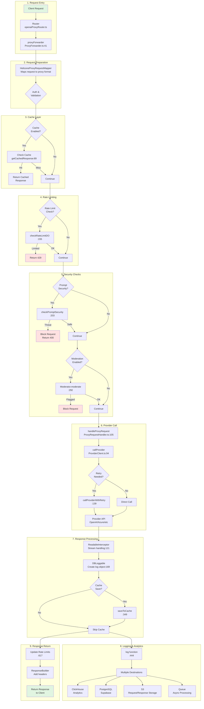

# Worker Logic Migration to /packages/gateway

## Overview

This document outlines the migration strategy for extracting core proxy logic from the Cloudflare Worker into a reusable `/packages/gateway` package. The approach follows a **bottom-up migration strategy**, starting with the most fundamental utilities and building up to the complete proxy orchestration.

## Current Architecture Flow



## Migration Phases (Bottom-Up Approach)

### Phase 1: Core Utilities
**Target:** `/packages/gateway/core`

**Files to migrate:**
- `/worker/src/lib/util/results.ts` → `/packages/gateway/core/results.ts`
- `/worker/src/lib/util/constants.ts` → `/packages/gateway/core/constants.ts`
- `/worker/src/lib/util/helpers.ts` → `/packages/gateway/core/helpers.ts`

**Interfaces:**
```typescript
// Result type for consistent error handling
export type Result<T, K> = SuccessResult<T> | ErrorResult<K>;
export function ok<T, K>(data: T): Result<T, K>;
export function err<T, K>(error: K): Result<T, K>;
```

**Dependencies:** None (leaf nodes)

---

### Phase 1.1: Response Building
**Target:** `/packages/gateway/response`

**Files to migrate:**
- `/worker/src/lib/ResponseBuilder.ts` → `/packages/gateway/response/ResponseBuilder.ts`

**Key Components:**
```typescript
export class ResponseBuilder {
  setHeader(key: string, value: string): ResponseBuilder;
  addRateLimitHeaders(result: RateLimitResponse, options: RateLimitOptions): void;
  build(params: BuildParams): Response;
  buildRateLimitedResponse(): Response;
}
```

**Dependencies:** 
- Phase 1 (Result types)
- Rate limit types (will be abstracted)

---

### Phase 1.2: Provider Client Basics
**Target:** `/packages/gateway/provider/base`

**Files to migrate:**
- `/worker/src/lib/clients/ProviderClient.ts` (partial) → `/packages/gateway/provider/base/`

**Components:**
```typescript
// Core URL building
export function buildTargetUrl(originalUrl: URL, apiBase: string): URL;

// Header utilities
export function removeHeliconeHeaders(headers: Headers): Headers;
export function joinHeaders(h1: Headers, h2: Headers): Headers;
```

**Dependencies:** Phase 1 utilities

---

### Phase 1.3: Stream Foundations
**Target:** `/packages/gateway/stream/base`

**New interfaces to create:**
```typescript
export interface StreamInterceptor {
  stream: ReadableStream;
  waitForStream(): Promise<CompletedStream>;
}

export interface CompletedStream {
  body: string[];
  reason: "cancel" | "done" | "timeout";
  endTimeUnix: number;
  firstChunkTimeUnix: number | null;
}
```

**Dependencies:** Phase 1 utilities

---

### Phase 1.4: Request/Response Types
**Target:** `/packages/gateway/types`

**Files to migrate:**
- Core type definitions from various files
- Interface contracts without business logic

**Key Types:**
```typescript
export interface ProxyRequest {
  requestId: string;
  provider: Provider;
  requestWrapper: RequestWrapper;
  // ... other core fields
}

export interface ProxyResponse {
  status: number;
  headers: Headers;
  body: ReadableStream | null;
}
```

**Dependencies:** Phase 1 utilities

---

### Phase 1.5: Provider Communication
**Target:** `/packages/gateway/provider/client`

**Files to migrate:**
- `/worker/src/lib/clients/ProviderClient.ts` (core functions)

**Components:**
```typescript
export async function callProvider(props: CallProps): Promise<Response>;
export async function callProviderWithRetry(props: CallProps, retry: RetryOptions): Promise<Response>;
```

**Dependencies:** 
- Phase 1.2 (Provider basics)
- Phase 1.4 (Types)

---

### Phase 2: Stream Processing
**Target:** `/packages/gateway/stream`

**Files to migrate:**
- `/worker/src/lib/util/ReadableInterceptor.ts` → `/packages/gateway/stream/ReadableInterceptor.ts`

**Key Components:**
- Full `ReadableInterceptor` class
- Stream transformation pipelines
- Response body accumulation
- Chunk processing with timeouts

**Dependencies:**
- Phase 1.3 (Stream foundations)
- Phase 1.4 (Types)

---

### Phase 3: Request Handling
**Target:** `/packages/gateway/handlers`

**Files to migrate:**
- `/worker/src/lib/HeliconeProxyRequest/ProxyRequestHandler.ts`

**Components:**
- `handleProxyRequest()`
- `handleThreatProxyRequest()`
- Response transformation logic

**Dependencies:**
- Phase 1-2 (All utilities and streaming)
- Phase 1.5 (Provider communication)

---

### Phase 4: Cache Layer
**Target:** `/packages/gateway/cache`

**Files to migrate:**
- `/worker/src/lib/util/cache/cacheFunctions.ts`
- `/worker/src/lib/util/cache/cacheSettings.ts`

**Abstraction needed:**
- KV storage interface
- Cache key generation
- TTL management

**Dependencies:**
- Phase 1-3 components
- Abstract KV interface

---

### Phase 5: Rate Limiting
**Target:** `/packages/gateway/rate-limit`

**Files to migrate:**
- Rate limit client logic
- Counter update logic

**Abstraction needed:**
- Durable Object interface
- Rate limit storage backend

**Dependencies:**
- Phase 1 utilities
- Abstract storage interface

---

### Phase 6: Security & Moderation
**Target:** `/packages/gateway/security`

**Files to migrate:**
- Prompt security client
- Moderation manager

**Components:**
- Security check interfaces
- Threat detection logic
- Moderation wrappers

**Dependencies:**
- Phase 1-3 components
- External API clients

---

### Phase 7: Logging Pipeline
**Target:** `/packages/gateway/logging`

**Files to migrate:**
- `/worker/src/lib/dbLogger/DBLoggable.ts`
- Logging orchestration from ProxyForwarder

**Components:**
- `DBLoggable` class
- Multi-destination logging
- Async logging pipeline
- Usage tracking

**Dependencies:**
- Phase 1-3 components
- Abstract storage interfaces

---

### Phase 8: Proxy Orchestration
**Target:** `/packages/gateway/proxy`

**Files to migrate:**
- `/worker/src/lib/HeliconeProxyRequest/ProxyForwarder.ts`

**This is the main orchestrator that:**
- Coordinates all previous phases
- Implements the full request flow
- Manages the pipeline from entry to exit

**Dependencies:** All previous phases

---

## Implementation Strategy

### Step 1: Create Package Structure
```bash
/packages/gateway/
├── package.json
├── tsconfig.json
├── src/
│   ├── core/           # Phase 1
│   ├── response/       # Phase 1.1
│   ├── provider/       # Phase 1.2, 1.5
│   ├── stream/         # Phase 1.3, 2
│   ├── types/          # Phase 1.4
│   ├── handlers/       # Phase 3
│   ├── cache/          # Phase 4
│   ├── rate-limit/     # Phase 5
│   ├── security/       # Phase 6
│   ├── logging/        # Phase 7
│   └── proxy/          # Phase 8
└── test/
```

### Step 2: Migration Order
1. Start with Phase 1 (core utilities) - no dependencies
2. Proceed through Phase 1.1-1.5 in parallel where possible
3. Complete Phase 2 after stream foundations are ready
4. Phases 3-7 can be worked on in parallel after Phase 2
5. Phase 8 must be last as it depends on all others

### Step 3: Abstraction Points
Create interfaces for platform-specific features:
```typescript
interface CacheStorage {
  get(key: string): Promise<any>;
  put(key: string, value: any, ttl?: number): Promise<void>;
}

interface RateLimitStorage {
  checkLimit(key: string, options: RateLimitOptions): Promise<RateLimitResponse>;
  updateCounter(key: string, cost: number): Promise<void>;
}

interface LogDestination {
  log(data: LogData): Promise<void>;
}
```

### Step 4: Testing Strategy
- Unit tests for each phase independently
- Integration tests for phase combinations
- E2E tests comparing worker vs package behavior
- Performance benchmarks for critical paths

---

## Phase 1 Completion ✅

### Migration Summary
Phase 1 has been **successfully completed** with the following accomplishments:

#### ✅ Created Gateway Package
- Created `/packages/gateway` with proper TypeScript configuration
- Migrated core utilities: Result types, constants, helpers
- Added comprehensive test suite (22 passing tests)
- Built successfully with proper type declarations

#### ✅ Updated Worker Dependencies
- Added `@helicone/gateway` dependency to worker package.json
- Updated **43 files** across the worker to import from gateway package:
  - 39 files importing Result types
  - 3 files importing helper functions  
  - 1 file importing constants
- Replaced `isErr` with `isError` for consistency

#### ✅ Removed Duplicated Code
- Deleted old utility files from worker:
  - `/worker/src/lib/util/results.ts`
  - `/worker/src/lib/util/helpers.ts` 
  - `/worker/src/lib/util/constants.ts`

#### ✅ Self-Contained Package
- Gateway package includes its own Result types (no cross-package dependencies)
- Clean exports through main index file
- Ready for use by other services

### Migration Benefits Achieved
1. **Code Reusability**: Core utilities now available to all services
2. **Consistency**: Single source of truth for Result types and utilities
3. **Maintainability**: Changes to core utilities happen in one place
4. **Testability**: Isolated testing of core functionality

---

## Validation Checklist

### Phase 1 Validation ✅
- [x] All files identified and migrated
- [x] Dependencies properly abstracted  
- [x] Types exported correctly
- [x] Unit tests passing (22/22)
- [x] No circular dependencies
- [x] Package builds successfully
- [x] Worker imports gateway package correctly
- [x] Old utility files removed
- [x] Import statements updated across codebase

### Integration Validation
- [x] Package builds successfully
- [x] Can be imported by worker
- [x] Can be imported by other services  
- [x] Maintains backward compatibility
- [ ] Performance metrics unchanged (to be tested)

### Final Validation
- [x] Worker using gateway package
- [ ] All tests passing (some unrelated type errors remain)
- [x] Documentation updated
- [ ] Performance benchmarks met (to be tested)
- [ ] Rollback plan tested (can restore from git)

---

## Benefits

1. **Reusability**: Gateway logic can be used by multiple services
2. **Testability**: Isolated components are easier to test
3. **Maintainability**: Clear separation of concerns
4. **Flexibility**: Different platforms can provide their own implementations
5. **Performance**: Optimized bundling for each use case

---

## Risks & Mitigation

| Risk | Mitigation |
|------|------------|
| Breaking changes | Feature flags for gradual rollout |
| Performance regression | Benchmark before/after each phase |
| Circular dependencies | Strict phase ordering, dependency analysis |
| Platform coupling | Abstract interfaces for platform features |
| Lost functionality | Comprehensive test coverage |

---

## Timeline Estimate

- **Phase 1 & 1.1-1.5**: 1 week (foundational, can parallelize)
- **Phase 2**: 3 days (stream processing)
- **Phase 3-7**: 2 weeks (can parallelize)
- **Phase 8**: 1 week (integration)
- **Testing & Validation**: 1 week
- **Total**: ~5 weeks with parallel work

---

## Next Steps

1. Create `/packages/gateway` directory structure
2. Set up build tooling and TypeScript configuration
3. Begin Phase 1 migration (core utilities)
4. Create abstraction interfaces for platform features
5. Set up testing infrastructure