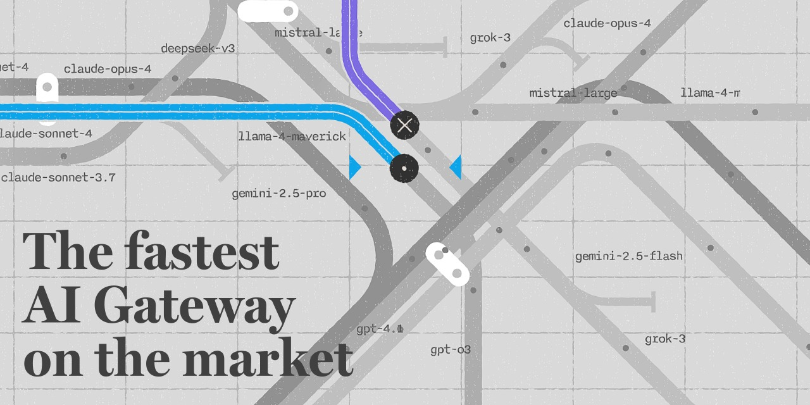

<Warning>
Still using our legacy cloud AI Gateway? Access the documentation [here](/features/advanced-usage/cloud-ai-gateway-overview). This version is being phased out in favor of a new cloud offering based on this improved self-hosted solution (coming soon).
</Warning>

# Why we're building the AI Gateway?

The AI development space is progressing at an exponential rate. We see it every day at Helicone—over 90 % of our users run 5 + LLMs in production, each with its own SDK, auth scheme, rate limits, and quirks.

Keeping up today means rewriting integrations for every new model, managing a maze of API keys, engineering custom fallbacks for provider outages, and constantly tuning traffic for cost or compliance.

Helicone AI Gateway is our answer. It is a lightweight Rust router inspired by NGINX that removes the integration tax so you can focus on shipping features.

# What do you get with the AI Gateway?

<CardGroup cols={2}>
<Card title="One line. 100+ models" icon="plug" href="/ai-gateway/quickstart">
  A unified interface for every LLM provider using familiar OpenAI syntax
</Card>
<Card title="Smart provider selection" icon="shuffle" href="/ai-gateway/concepts/load-balancing">
  Load balance to always hit the fastest, cheapest, or most reliable option
</Card>
<Card title="Spending controls" icon="shield" href="/ai-gateway/concepts/rate-limiting">
  Rate limit to prevent runaway costs and usage abuse
</Card>
<Card title="Reduced latency" icon="clock" href="/ai-gateway/concepts/cache">
  Cache responses to reduce costs and latency by up to 95%
</Card>
<Card title="Guaranteed uptime" icon="key" href="/ai-gateway/concepts/load-balancing">
  Fallback to a different provider or model if the primary one is down
</Card>
<Card title="Centralized API keys" icon="key" href="/ai-gateway/concepts/secret-management">
  Store all API keys securely to end credential chaos and security risks
</Card>
<Card title="Simplified tracing" icon="eye" href="/helicone">
  Monitor your AI workflows with built-in Helicone integration
</Card>
<Card title="One Click Deploy" icon="key" href="/ai-gateway/deployment/overview">
  Deploy to Fly.io, AWS, Porter, or any other platform in minutes
</Card>
</CardGroup>

# What sets our AI Gateway apart?

Built in Rust, the Gateway ships as one lightweight binary you can run anywhere:

- **Self-hosted by default** - deployable standalone or with Redis and Helicone for additional features
- **Sidecar-friendly** - drop into Docker, Kubernetes, bare-metal, or spawn as a subprocess
- **Built with Tower** - Configurable middleware that leverages the Tower ecosystem
- **NGINX-style proxy** - local gateway to any provider, model, or region
- **Horizontally scalable** - run 1-N instances behind any load balancer
- **Open-source** - Apache licensed, no vendor lock-in

# Let's get started!
<Card title="Quickstart" icon="plug" href="/ai-gateway/quickstart" horizontal>
  Get started in 1 minute with our quickstart guide
</Card>
