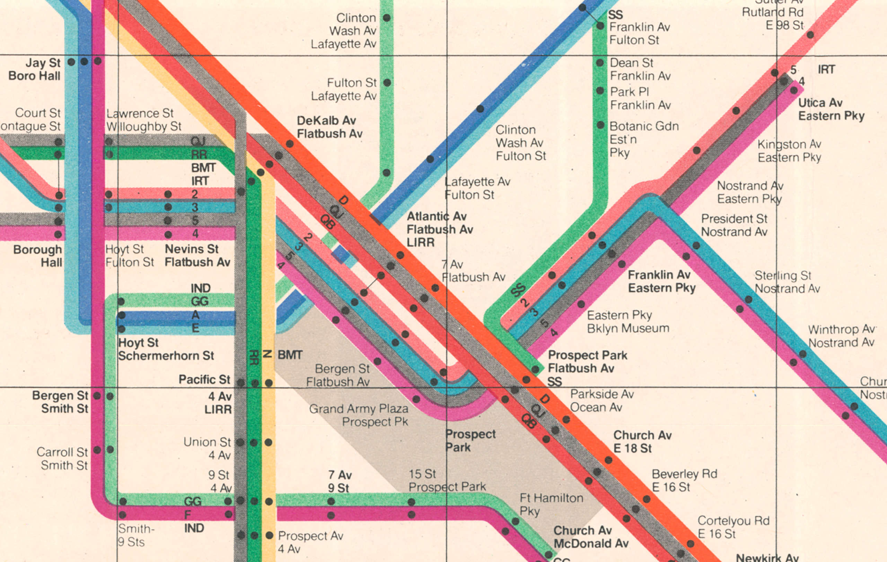

<Note>
  Helix is built and maintained by the team at
  [Helicone](https://helicone.ai).
</Note>

# Why use Helix?

AI applications require multiple providers by necessity, different models excel at different tasks, costs vary 10x, and no single provider maintains 100% uptime. Without a router, your code becomes a tangled mess of provider-specific retry logic and fallback chains.

We're taking what we've learned from monitoring thousands of production AI applications at Helicone and building the solution we wish existed. **Nginx solved this for web requests. We're building it for LLMs.**

# What can Helix do?

- **Unified API** - use OpenAI SDK format for Anthropic, Bedrock, Vertex AI, or any provider
- **[Intelligent load balancing](/loadbalancing)** — P2C + PeakEWMA, weighted, or cost-optimized routing by provider _(models, deployments, regions coming soon)_
- **[Secrets management](/secret-management)** - Secure API key storage via environment variables, encrypted database, or external secret managers
- **[Rate limiting & spend controls](/rate-limiting)** - Multi-dimensional limits by user, team, provider, or globally with request, token, and cost controls
- **[Response caching](/cache)** - Redis and S3-backed intelligent caching to reduce costs and improve latency=
- **Health checks** - Automatic health checks for each provider, model, or region
- **[OpenTelemetry observability](/otel-observability)** - Distributed tracing, metrics, and logs with OTLP export

# What makes Helix different?

Built in Rust, Helix ships as one lightweight binary you can run anywhere:

- **Self-hosted by default** - needs only Redis, nothing else
- **Sidecar-friendly** - drop into Docker, Kubernetes, bare-metal, or spawn as a subprocess
- **NGINX-style proxy** - local gateway to any provider, model, or region
- **Built with Tower** - P2C + PeakEWMA load-balancing, retries, and timeouts are just middleware layers
- **Horizontally scalable** - run 1-N instances behind any load balancer
- **Open-source** - MIT licensed, no vendor lock-in
