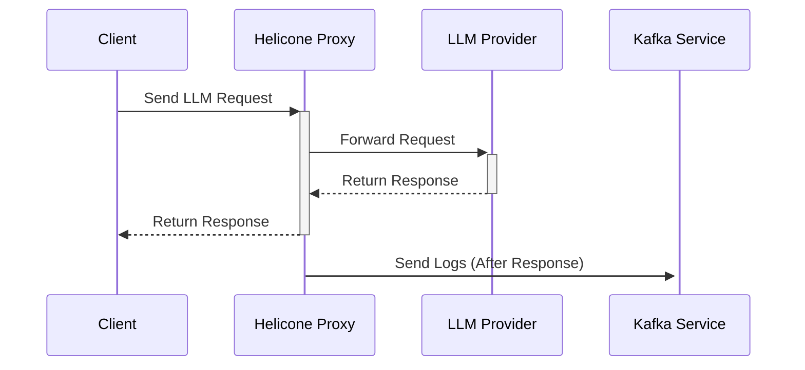
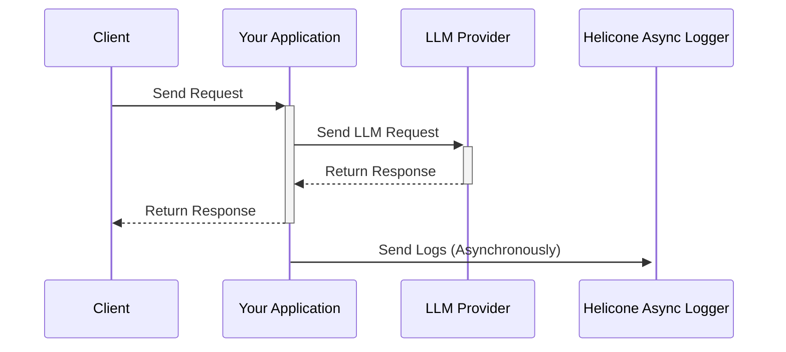

Helicone leverages Cloudflare's global network of over 330 data centers worldwide to ensure high availability and reliability for your LLM requests. Our proxy is deployed on Cloudflare Workers, providing a fully distributed and fault-tolerant infrastructure.

## How Helicone Ensures High Availability

Our proxy is designed with minimal business logic to maximize performance and reliability:

- **Selective Business Logic**: Unless headers enabling specific features are included, our proxy does not apply any additional business logic. By default, we simply proxy your LLM requests directly to the provider.

- **Robust Error Handling**: We wrap all of our business logic code in comprehensive error handling. No matter what happens, we gracefully fallback to just proxying the LLM request, ensuring uninterrupted service.

- **Post-Response Logging**: After returning the entire response to you, we send logs to Kafka to be consumed by a completely separate service. This ensures that logging does not impact the response time of your requests.

<Icon icon="check" size={32} /> **Your requests are handled efficiently and reliably
with Helicone.**

## Deployment Practices

To maintain the stability and reliability of our proxy, we follow rigorous deployment steps:

1. **Infrequent Updates**: We rarely make changes to our proxy, updating it approximately once a month.

2. **Comprehensive Testing**: Before any deployment, we run a suite of integration and unit tests to ensure all functionalities work as intended.

3. **Manual Quality Assurance**: Our team performs manual QA to catch any issues that automated tests might miss.

4. **Code Approval**: All code changes require approval from one of our technical co-founders before deployment.

5. **Gradual Rollout**: We slowly roll out updates over an entire day using Cloudflare Workers' gradual deployment feature, deploying to a small percentage of traffic at a time.

## Logging Process Overview

The following sequence diagram illustrates how we log only after the response is returned:

By sending logs to Kafka only after the response is returned to the client, we ensure that our logging process does not affect the latency or reliability of your applications.

## Alternative Integration: Asynchronous Logging

If you still have concerns about Helicone being in your critical path, we offer an alternative integration method that allows you to interact directly with your LLM provider and log asynchronously. This ensures that Helicone does not interfere with your application's request flow, providing you with the same observability benefits without any impact on your request handling.

### How Asynchronous Logging Works

In this approach, your application communicates directly with the LLM provider. After receiving the response, you log the request and response data asynchronously to Helicone. This method completely removes Helicone from your critical path, ensuring maximum reliability and minimal latency.

Here's a sequence diagram illustrating the asynchronous logging process:

### Getting Started with Asynchronous Logging

We provide SDKs and guides to help you set up asynchronous logging easily:

- **OpenLLMetry Integration**: Log LLM traces directly to Helicone, bypassing our proxy, with OpenLLMetry. Supports OpenAI, Anthropic, Azure OpenAI, Cohere, Bedrock, Google AI Platform, and more. [Learn more](https://docs.helicone.ai/getting-started/integration-method/openllmetry).

- **Custom Model Integration**: Integrate any custom LLM, including open-source models like Llama and GPT-Neo, with Helicone. [Learn more](https://docs.helicone.ai/getting-started/integration-method/custom).

<Icon icon="check" size={32} /> **With asynchronous logging, Helicone stays out of
your critical path.**

---

If you have any questions or need assistance setting up asynchronous logging, feel free to reach out in our [Discord](https://discord.gg/zsSTcH2qhG)!
